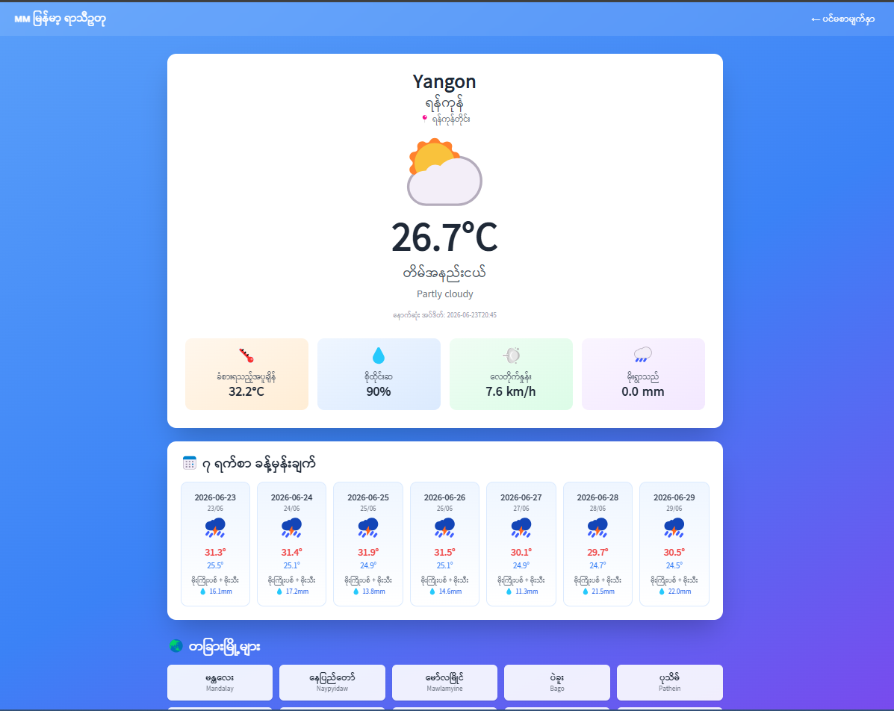
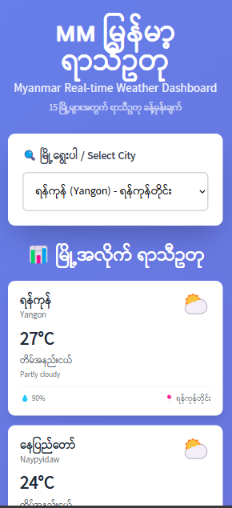

<div align="center">

# 🇲🇲 Myanmar Weather App

**Real-time weather information for Myanmar's major cities**

[](https://www.python.org/)
[](https://flask.palletsprojects.com/)
[](https://vercel.com/)

[Live Demo](https://weather-focusing.vercel.app/) · [Request Feature](https://github.com/username/myanmar-weather/issues)

</div>

---

## 📸 Screenshots

<div align="center">

### Homepage


### City Detail Page



### Mobile View



</div>

---

## ✨ Features

### Current Features

- 🌦️ **Real-time Weather Data** - Live weather updates every 5 minutes
- 🏙️ **15+ Myanmar Cities** - Coverage of all major cities across regions
- 📅 **7-Day Forecast** - Detailed weather predictions
- 🌐 **Bilingual Interface** - Complete Myanmar (မြန်မာ) and English support
- 🗺️ **Region Organization** - Cities grouped by state/region
- 📱 **Responsive Design** - Works on mobile, tablet, and desktop
- 🎨 **Dynamic Backgrounds** - Changes based on weather conditions
- ⚡ **Smart Caching** - 5-minute cache reduces API calls by 95%
- 🔄 **Auto Refresh** - Dashboard updates automatically
- 🎯 **Dynamic Routing** - Individual pages for each city

### 🚧 Planned Features (Roadmap)

- [ ] 🗺️ Interactive map (Leaflet.js)
- [ ] 📊 Weather charts (Chart.js)
- [ ] 🌡️ Air Quality Index (AQI)
- [ ] 💾 Favorites system
- [ ] 🔍 City search with autocomplete
- [ ] 🌙 Dark mode
- [ ] 📱 PWA support (offline access)
- [ ] 🔔 Weather alerts & notifications
- [ ] 🤖 Telegram bot integration
- [ ] 📲 Mobile app (iOS/Android)
- [ ] 🌅 Sunrise/sunset times
- [ ] 💨 Hourly wind patterns
- [ ] 🛰️ Satellite imagery

---

## 🛠️ Tech Stack

### Backend

- **Python 3.13** - Programming language
- **Flask 3.1.0** - Web framework
- **httpx 0.28.1** - Async HTTP client
- **ThreadPoolExecutor** - Concurrent request handling
- **Jinja2** - Template engine

### Frontend

- **HTML5** - Structure
- **Tailwind CSS** - Styling (via CDN)
- **Vanilla JavaScript** - Dynamic interactions
- **Google Fonts** - Myanmar font support (Pyidaungsu)

### API & Data

- **Open-Meteo API** - Weather data source
  - Free tier
  - No API key required
  - No VPN needed
  - Commercial use allowed

### Deployment

- **Vercel** - Serverless hosting
- **GitHub** - Version control & CI/CD

---

## 📂 Project Structure

myanmar-weather/
│
├── api/
│ └── index.py # ⚡ Vercel entry point (Flask app)
│
├── src/
│ ├── api/
│ │ ├── **init**.py # 📦 Python package marker
│ │ ├── cities.py # 🏙️ Myanmar cities data + helpers
│ │ └── weather_service.py # 🌦️ Weather API logic + caching
│ │
│ └── templates/
│ ├── base.html # 🎨 Base layout (CSS + common JS)
│ ├── index.html # 🏠 Homepage (dashboard)
│ └── city.html # 📍 City detail page
│
├── screenshots/ # 📸 Optional: README images
│ ├── homepage.png
│ ├── city-detail.png
│ └── mobile.png
│
├── .gitignore # 🚫 Git ignore rules
├── LICENSE # 📄 MIT License
├── README.md # 📖 Project documentation
├── requirements.txt # 📦 Python dependencies
└── vercel.json # ⚙️ Vercel deployment config

---

## 🚀 Getting Started

### Prerequisites

- Python 3.9 or higher
- pip (Python package manager)
- Git

### Installation

1. **Clone the repository**
   ```bash
   git clone https://github.com/username/myanmar-weather.git
   cd myanmar-weather
   ```
